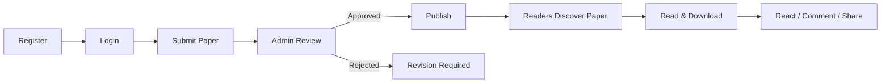
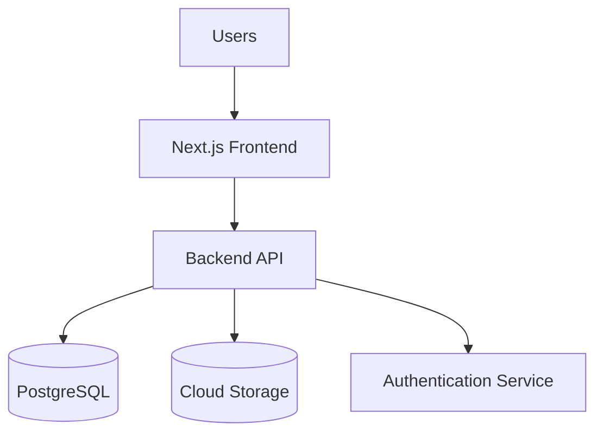
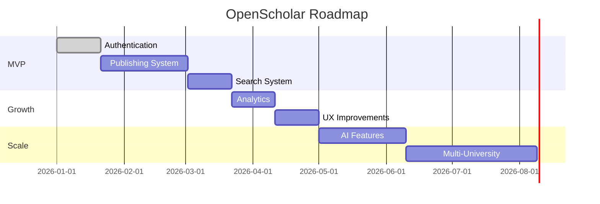

# Product Requirements Document (PRD)

# OpenScholar

> **Version:** 1.0  
> **Status:** MVP Planning (Updated)

---

# Table of Contents

- [1. Product Overview](#1-product-overview)
- [2. Goals and Success Metrics](#2-goals-and-success-metrics)
- [3. Target Users](#3-target-users)
- [4. Feature Prioritization (MoSCoW)](#4-feature-prioritization-moscow)
- [5. Differentiation](#5-differentiation)
- [6. User Flow](#6-user-flow)
- [7. System Architecture](#7-system-architecture)
- [8. Non-Functional Requirements](#8-non-functional-requirements)
- [9. Constraints](#9-constraints)
- [10. Risks and Mitigation](#10-risks-and-mitigation)
- [11. Roadmap](#11-roadmap)
- [12. MVP Definition](#12-mvp-definition)
- [13. Acceptance Criteria](#13-acceptance-criteria)
- [14. Product Philosophy](#14-product-philosophy)

---

# 1. Product Overview

## 1.1 Vision

To build a global open-access academic research platform where students can publish, discover, and access research without institutional or financial barriers.

---

## 1.2 Mission

- Democratize access to academic knowledge
- Enable student-first research publishing
- Build a scalable academic knowledge network
- Replace outdated research platforms with modern systems

---

## 1.3 Problem Statement

- Research is restricted by paywalls
- Platforms require institutional email access
- Student research lacks visibility
- Existing platforms have poor usability
- No centralized academic repository in Bangladesh

---

## 1.4 Solution Summary

### OpenScholar provides:

- Open-access research publishing
- Free reading and downloading
- Simple publishing workflow
- Modern UI/UX
- Scalable architecture

---

# 2. Goals and Success Metrics

## 2.1 Business Goals

- Launch MVP within 4–5 months
- Onboard initial university
- Expand to multiple universities within 1 year

---

## 2.2 Product Goals

- Paper publishing within 5 minutes
- Search response time under 2 seconds
- High readability experience
- Free access to all content

---

## 2.3 Success Metrics

| Metric | Target |
|---|---|
| Monthly Active Users | 10,000+ |
| Papers Published | 5,000+ |
| Average Session Time | 5+ minutes |
| Upload Success Rate | 99% |
| Search Response Time | < 2 seconds |
| Retention Rate | 40%+ |

---

# 3. Target Users

## Primary Users

- Undergraduate students
- Graduate students
- Research scholars

## Secondary Users

- Faculty members
- Universities
- General researchers

---

# 4. Feature Prioritization (MoSCoW)

## 4.1 Must Have (MVP Core)

### Authentication

- Email/password login
- Email verification
- Password reset
- Role-based access control

### User Profile

- Basic profile
- Publication list

### Research Publishing

- PDF upload (≤50MB)
- Metadata input:
  - Title
  - Abstract
  - Keywords
- University and department selection
- Draft saving
- Version control (mandatory for edits)
- Multi-author support
- Author ordering (1st, 2nd, etc.)
- Submission status management

### Admin Moderation

- Approve/reject submissions
- Publish approved papers
- Moderation logging

### Paper Viewing

- Paper details page
- PDF viewer
- Download functionality

### Search and Discovery

- Keyword search
- Filters:
  - University
  - Department
  - Year

### User Engagement

- Reactions (1 per user per paper)
- Comments
- Reply to comments (1-level nesting)
- Share (link/social)

### Basic Analytics

- View tracking
- Download tracking

### Core Non-Functional Requirements

- Page load under 3 seconds
- Search response under 2 seconds
- Secure authentication
- HTTPS communication
- 99% uptime

---

## 4.2 Should Have

- Dashboard (user analytics, most viewed papers)
- Citation export
- Multilingual support (English & Bangla)
- Enhanced search filters (category)
- Security enhancements

---

## 4.3 Could Have

- Focus reading mode
- Bookmark/save papers
- Notifications
- Advanced analytics (author-level, ranking)
- Caching and CDN

---

## 4.4 Won’t Have (MVP Excluded)

- DOI integration
- Peer review system
- AI recommendation engine
- Automated plagiarism detection
- Paid subscription system

---

# 5. Differentiation

- Clean, user-focused interface
- Simplified publishing workflow
- Open-access model
- Student-centered design
- Engagement-driven academic platform

---

# 6. User Flow

## Publishing Flow

```text
Register
   ↓
Login
   ↓
Submit Paper
   ↓
Admin Review
   ↓
Publish
```

## Discovery Flow

```text
Search
   ↓
Filter
   ↓
Open Paper
   ↓
Read
   ↓
Download
   ↓
Interact (react/comment/share)
```

## User Flow Diagram



---

# 7. System Architecture

| Layer | Technology |
|---|---|
| Frontend | Next.js |
| Backend | API-based architecture |
| Database | PostgreSQL |
| Storage | Cloud storage (S3 or equivalent) |
| Authentication | JWT/session-based |

## High-Level Architecture Diagram



---

# 8. Non-Functional Requirements

## Must

- Performance: <3 seconds load time
- Security: encryption and HTTPS
- Reliability: 99% uptime

## Should

- Scalability: multi-university support
- Maintainability: modular architecture

## Could

- Zero-downtime deployment
- Advanced monitoring

---

# 9. Constraints

- Limited moderation resources
- Initial deployment limited to one university
- No DOI integration in MVP
- No automated plagiarism detection

---

# 10. Risks and Mitigation

| Risk | Mitigation |
|---|---|
| Fake submissions | Admin moderation |
| Plagiarism | Manual review |
| Low adoption | University onboarding |
| System overload | Cloud scaling |

---

# 11. Roadmap

## Phase 1 (MVP)

- Authentication
- Publishing system
- Search
- Admin panel
- Engagement features

## Phase 2

- Analytics improvements
- UX improvements
- Search optimization

## Phase 3

- AI features
- Recommendation system

## Phase 4

- Multi-university expansion
- Global scaling

## Roadmap Visualization



---

# 12. MVP Definition

## Includes

- Authentication
- Profile management
- Paper upload (multi-author)
- Admin approval
- Search
- Reading & download
- Reactions, comments, sharing

---

# 13. Acceptance Criteria

## Paper Upload

- PDF ≤ 50MB
- Metadata required
- Supports multiple authors with order
- Status = pending

## Search

- Results within 2 seconds
- Filters operational

## Authentication

- Email verification required
- Invalid login blocked

## Engagement

- One reaction per user per paper
- Comment and reply functional

---

# 14. Product Philosophy

- Open access
- Simplicity
- Clean design
- Accessibility
- Scalability

